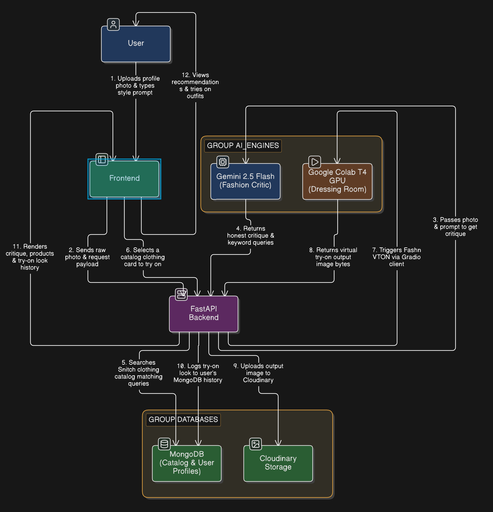

# Fitzy Virtual Try-On

**See yourself wearing real, purchasable outfits before you buy.**

## Overview

Virtual Try-On is an AI-powered fashion platform that helps users visualize outfits on their own photos using real products from online stores. Users upload a full-body image, enter a style prompt, and receive personalized outfit recommendations with realistic AI-generated try-ons.

## Features

* Full-body photo upload
* Style prompt input (e.g., Korean Streetwear, CEO Look)
* AI-powered outfit recommendations
* Virtual try-on generation
* Direct shopping links to products
* Personal wardrobe integration for better suggestions
* Save favorite outfits and looks

## Tech Stack

* **Frontend:** React
* **Backend:** FastAPI
* **Database:** MongoDB, Cloudinary
* **AI/ML:** Gemini, CLIP, FAISS, StableVITON

## Team

* **Akshita** — AI/ML
* **Utkarsh** — Backend
* **Yashika** — Frontend

## Business Model

* Affiliate commissions
* Premium subscriptions
* Brand partnerships
* B2B SaaS licensing
* Sponsored product placements

## USP

**"Shop your style, not just products."**

Personalized AI styling combined with virtual try-on using real, purchasable fashion products.
