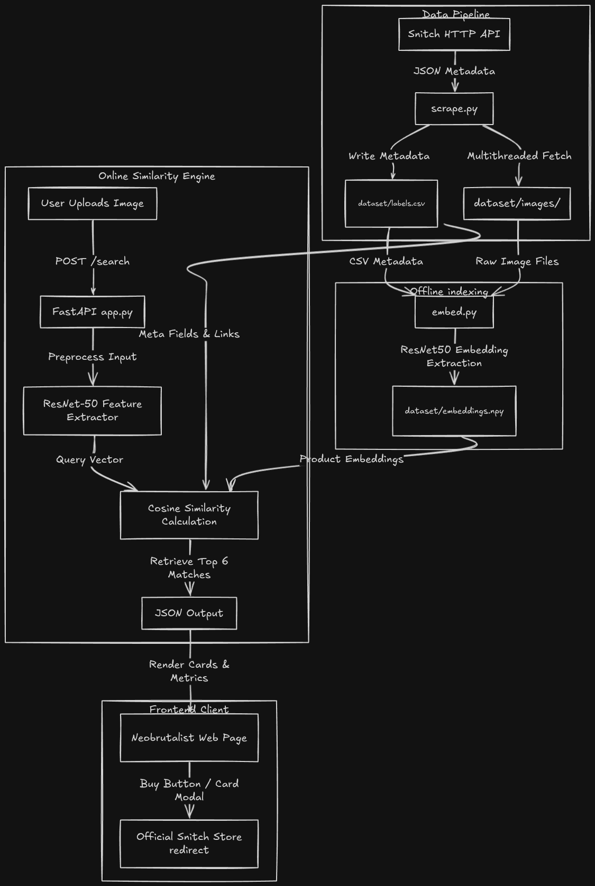

# Fashion Similarity Search Engine

A high-performance fashion similarity search system that retrieves clothing items matching the visual characteristics of a user-uploaded image. The backend uses a pre-trained **ResNet-50** deep neural network as a feature extractor, with a minimal **neobrutalist** frontend designed for direct shopping redirection.

---

## System Architecture & Logic Flow

The engine operates in three main phases: **Metadata & Image Scraping**, **Feature Embedding Compilation**, and **Real-Time Similarity Inquiry**.



---

## Project Directory Structure

```bash
├── app.py              # FastAPI server containing embedding-search endpoints
├── scrape.py           # Multithreaded product metadata & image downloader
├── embed.py            # Feature extractor constructing vectors using ResNet-50
├── index.html          # Clean high-contrast Neobrutalist search page
├── dataset/            # Data storage folder
│   ├── images/         # Storage for the 900 downloaded JPG/WEBP images
│   ├── labels.csv      # Unified product metadata and direct purchase links
│   └── embeddings.npy  # Saved numpy array of shape (900, 2048)
└── README.md           # Documentation & Architecture Overview
```

---

## Phase Details

### 1. Metadata Scraping (scrape.py)
Fetches **100 products per category** (9 categories total -> 900 products) from the Snitch search API.
*   **Target Categories**: Shirts, T-Shirts/Polo, Jeans, Trousers, Footwear, Cargo Pants, Joggers, Shorts, and Overshirts.
*   **Purchase URLs**: Uses the product ID and URL handle to compile the exact product checkout page:
    `https://www.snitch.com/{category_slug}/{handle}/{product_id}/buy`
*   **Limiter**: Implements a concurrent rate limiter preventing API rejection.

### 2. Feature Extraction (embed.py)
Extracts the features of all downloaded images offline.
*   Uses PyTorch and a pre-trained **ResNet-50** model.
*   Truncates the final classification layer (fc) to output a high-fidelity **2,048-dimensional visual embedding**.
*   Normalizes and compiles vectors into `dataset/embeddings.npy`.

### 3. Server Querying & UI Serving (app.py)
Serves a FastAPI web service on port 8000.
*   **Startup**: Loads metadata CSV and embeds array into RAM for fast search queries.
*   **Endpoint /search**: Receives user-uploaded images, applies ImageNet preprocessing, performs inference to calculate the query embedding, and computes the **Cosine Similarity**:
    $$\text{Similarity} = \frac{A \cdot B}{\|A\| \|B\|}$$
*   **Retrieval**: Returns the **top 6** closest matching products.

---

## How to Run & Initialize

1. **Install Dependencies**:
   ```bash
   pip install fastapi uvicorn torch torchvision pandas pillow requests numpy
   ```

2. **Scrape Products & Fetch Images**:
   ```bash
   python3 scrape.py
   ```

3. **Generate Embeddings**:
   ```bash
   python3 embed.py
   ```

4. **Launch the Similarity Web Server**:
   ```bash
   python3 -m uvicorn app:app --host 0.0.0.0 --port 8000
   ```
   Open `http://localhost:8000` in your web browser.
